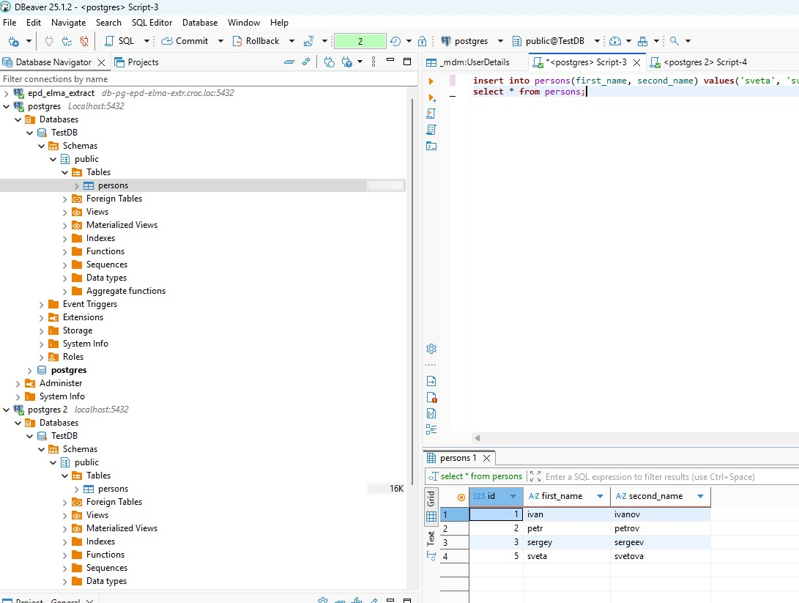
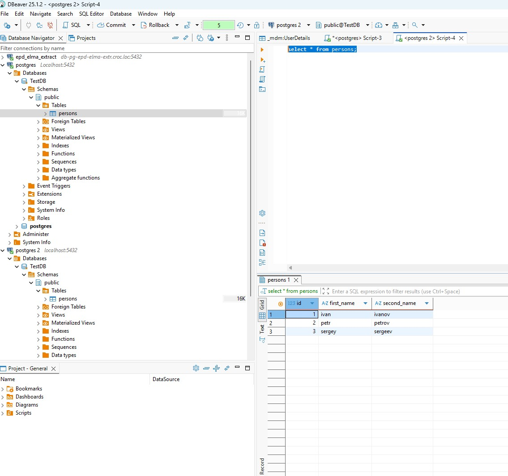
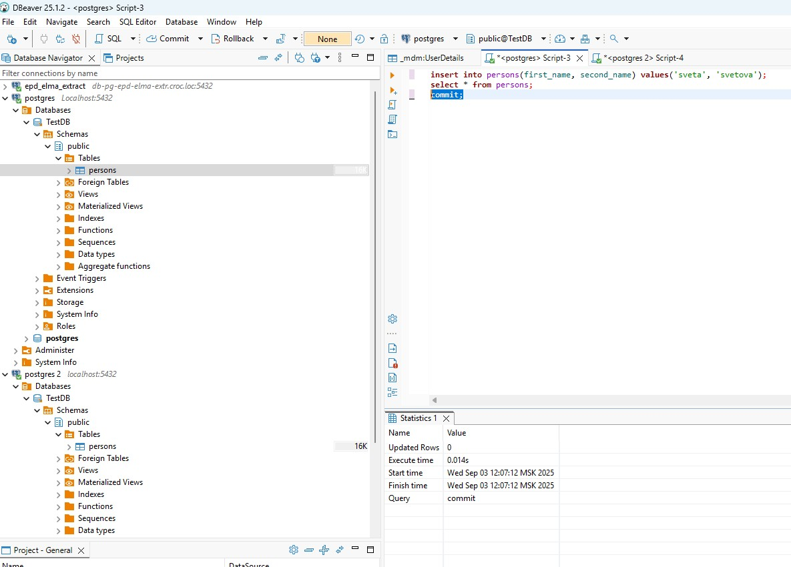

### Домашнее задание 1 ###
1. Установлен Docker
1. В контейнере Docker установлен Postgres
1. Создана таблица, согласно ТЗ 
1. Видим результат 
1. Добавляем запись , видим, что во второй сессии ее нет . Это объясняется тем, что commit не был сделан, запись для второй сессии не видна. Она появляется только после  commit в первой сессии. 
1. Делаем insert into persons(first_name, second_name) values('sveta', 'svetova'); в первой сессии с новым уровнем изоляции : 
1. Во второй сессии ее нет, потому что нет commit.
1. После commit ее видно 
1. Если во второй сессии внести изменения , то первая сессия увидит их 

### Исправленине ДЗ ###
1. В первой сессии внесли изменения : 
1. Commit нет, поэтому во второй не видим: 
1. В первой делаем commit , во торой не видим снова: 
1. Делаем commit во второй и только после этого видим изменения: 
 

