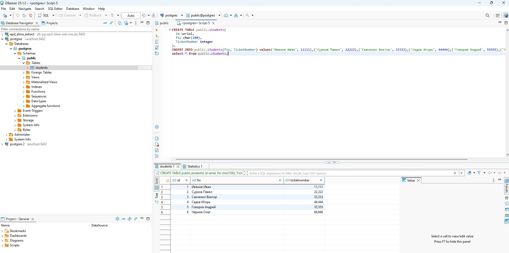
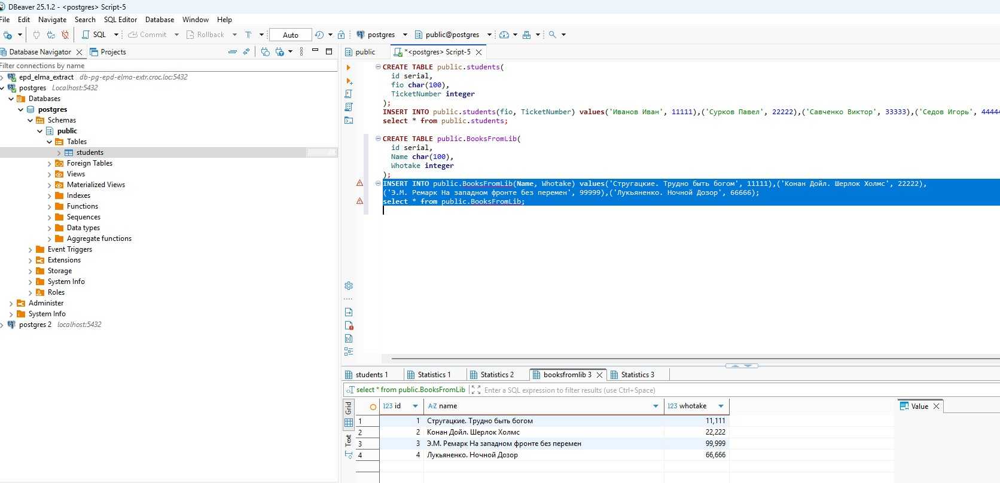
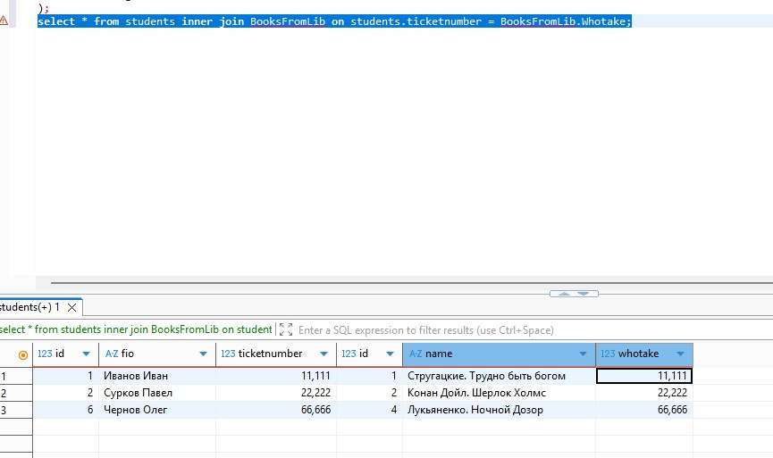
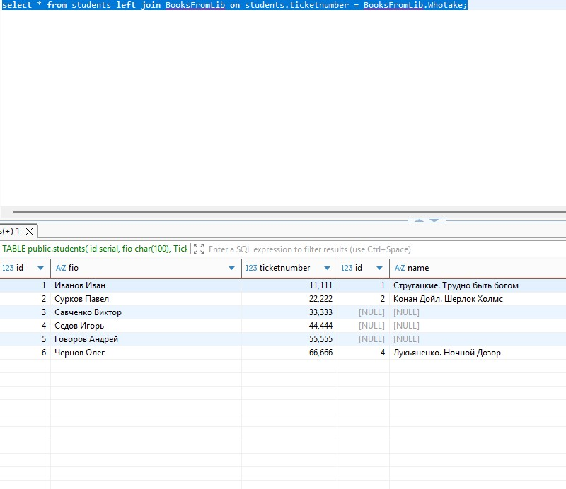
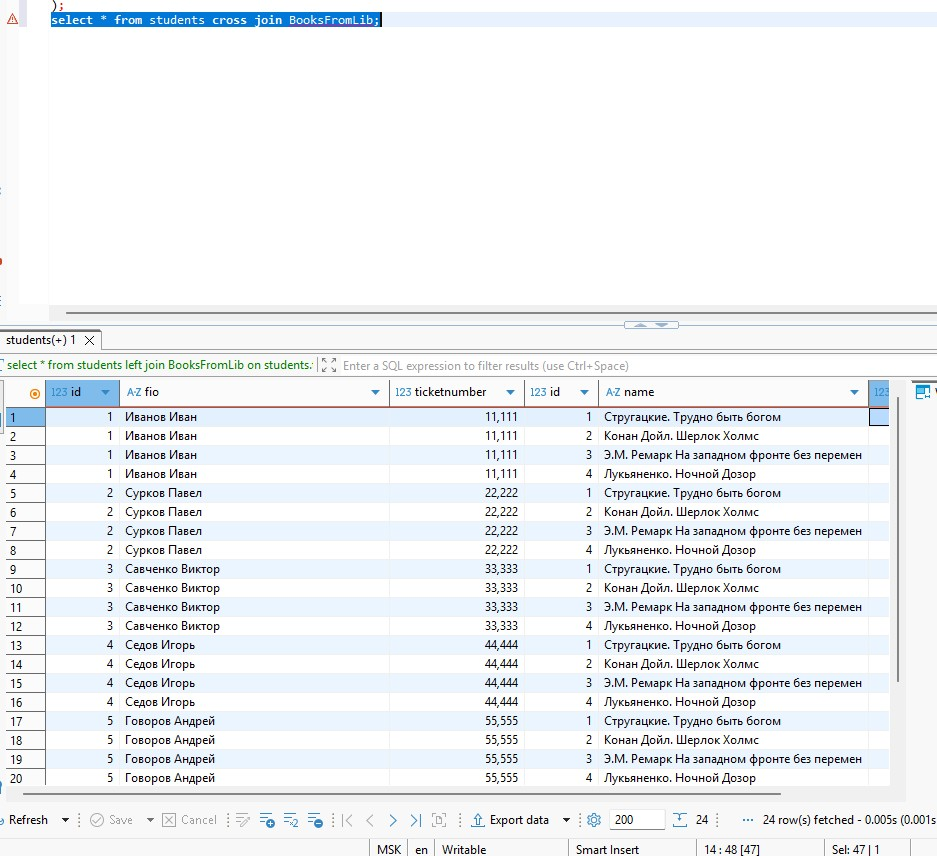
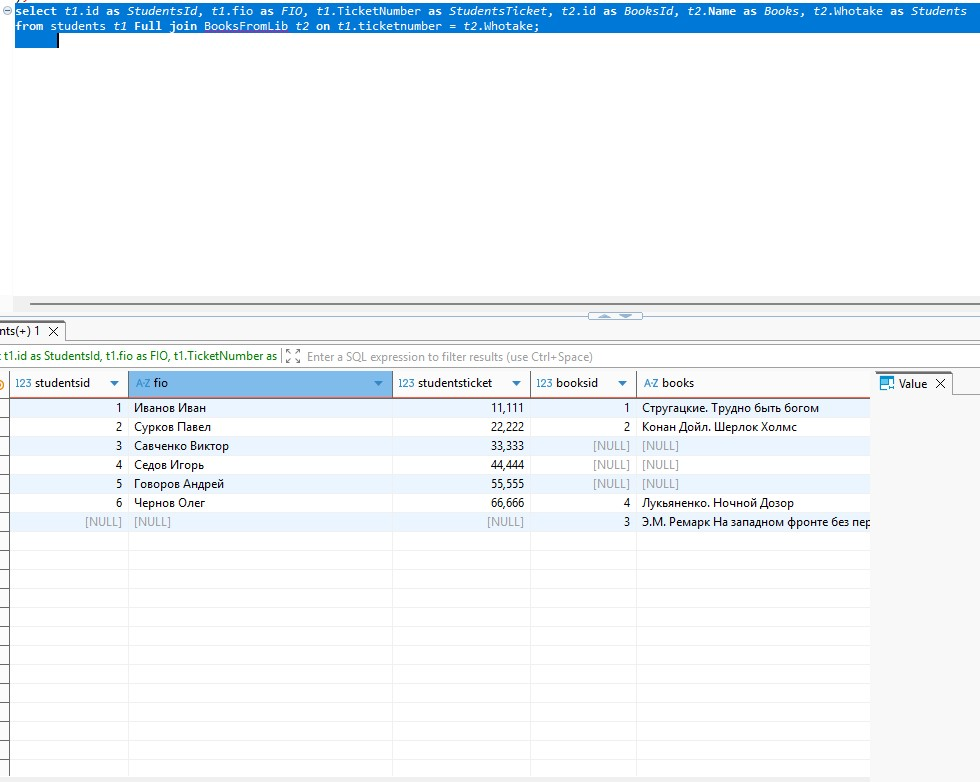
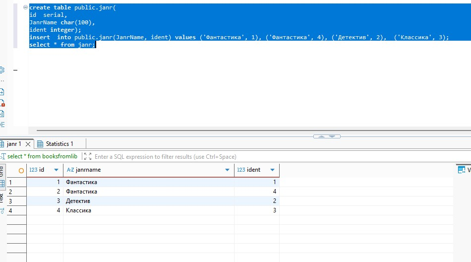
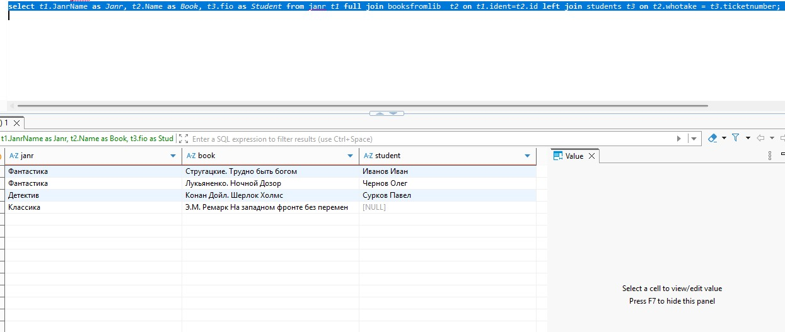

### Домашнее задание 11 ###
1. Создадим две таблицы: ,   Одна хранит список студентов, другая  - список книг, которые они взяли из библиотеки. Делаем прямое соединение двух таблиц:  Видим только те строки из таблиц, в которых совпадает значение по условию выборки. 
1. Делаем  left join : . Ожидаемо видим все строки из таблицы students и только часть из таблицы BooksFromLib, т.к. это соотвествует типу джойна.
1. Кросс соединение даст нам декартово поризведение таблиц: 
1. Полное соединение таблиц:  Здесь видим строки из первой и второй таблиц, там, где строки по условию не соединены, стоит NULL в первой или второй таблице.
1. Создадим третью таблицу - таблицу жанров книг: 
1. Получим список всех книг по жанрам с указанием студентов, взявших эти книги:  Имеем все книги в списке, и видим, что классикой никто не интересовался.