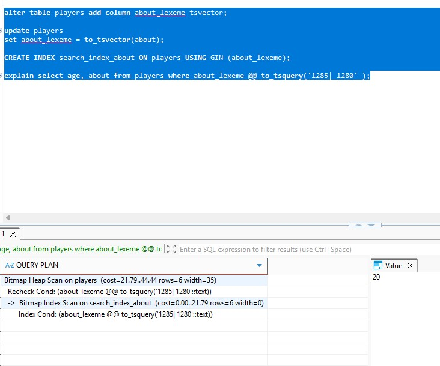
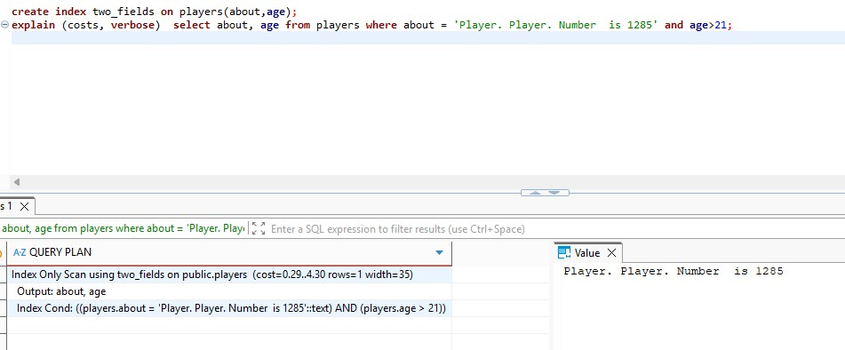
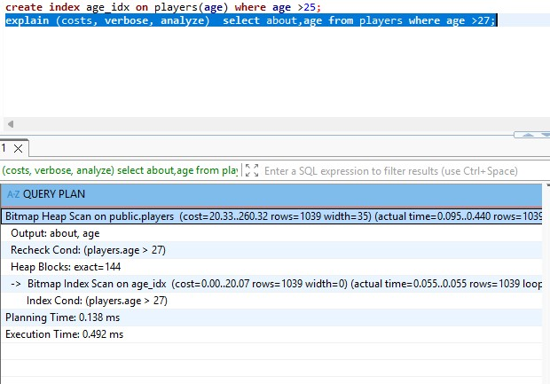

### Домашнее задание 13 ###
1. Создадим таблицу: , 
1. Создаем индекс по полю name:  create  index  year_id on books(year); commit ;

1. Запрос explain (costs,verbose) select year from books where year>2000; возвращает  QUERY PLAN
-------------------------------------------------------------
 Seq Scan on public.books  (cost=0.00..1.38 rows=10 width=4)
   Output: year
   Filter: (books.year > 2000)
(3 rows)
1.Реализация полнотекстового индекса: 

alter table books add column name_lexeme tsvector; commit;

update books

set name_lexeme = to_tsvector(name); commit;

CREATE INDEX search_index_name ON books USING GIN (name_lexeme); commit;

Пример запроса: 

explain select isbn, name from books where name_lexeme @@ to_tsquery('Пьесы | Рассказы' ); 

Seq Scan on books  (cost=0.00..9.88 rows=3 width=38)
  
Filter: (name_lexeme @@ to_tsquery('Пьесы | Рассказы'::text)) 

4. Индекс по двум полям: 

5. Индекс на часть таблицы:

6. Создавал все индексы через DBeaver при соединении с Postgresql в контейнере Docker. Индексы создавались без проблем, их свойства при просмотре соответствовали ожиданию, но нигде не получил в Explain указанную на занятии фразу Seq Index Scan, везде только Filter. Как написано в интернете, данная ситуация наблюдается, если условие поиска не полностью соответствует индексу, однако не нашел каких-либо различий между моими примерами и примерами, рассмотренными на занятии.

