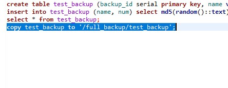
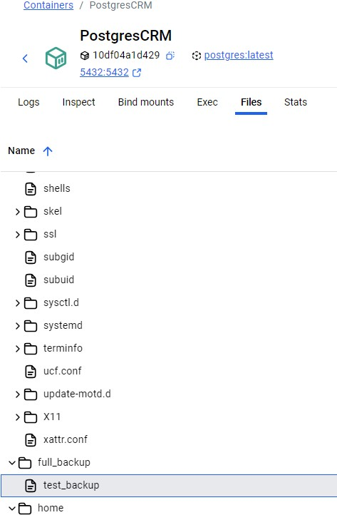
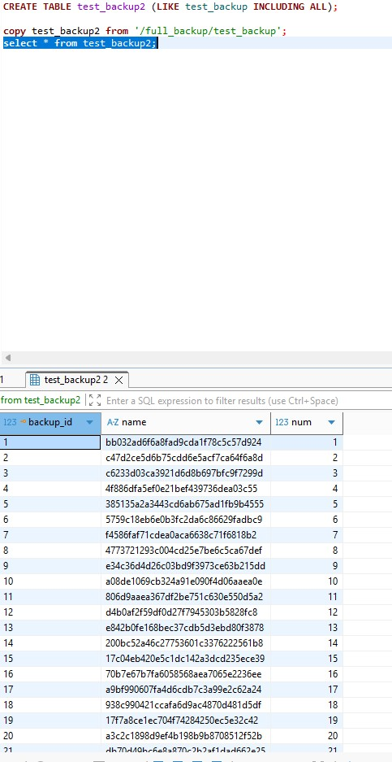
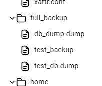
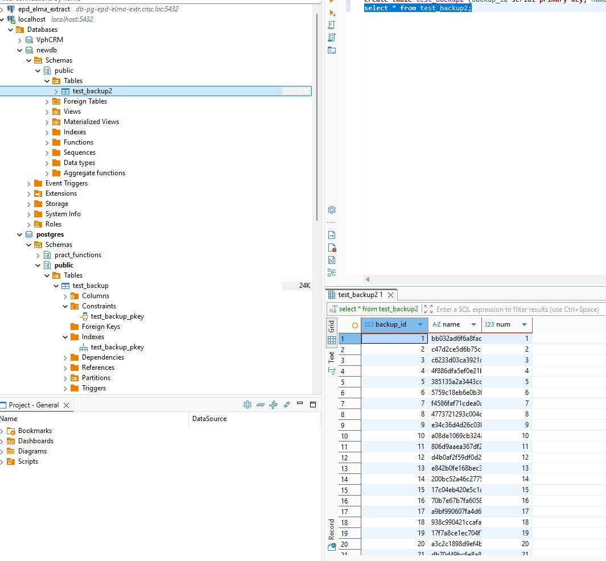

### Домашнее задание 13 ###
1. Создадим таблицу: . 
1. Копируем таблицу в файл: 

Видим, что файл появился в каталоге:

3. Копируем данные в другую таблицу: 

4. Делаем дамп БД: pg_dump -Fc postgres -f /full_backup/test_db.dump  -U postgres
Видим созданный файл:

5. Восстанавливаем в новую БД только одну таблицу: pg_restore -d newdb /full_backup/test_db.dump -t test_backup2 -U postgres 

