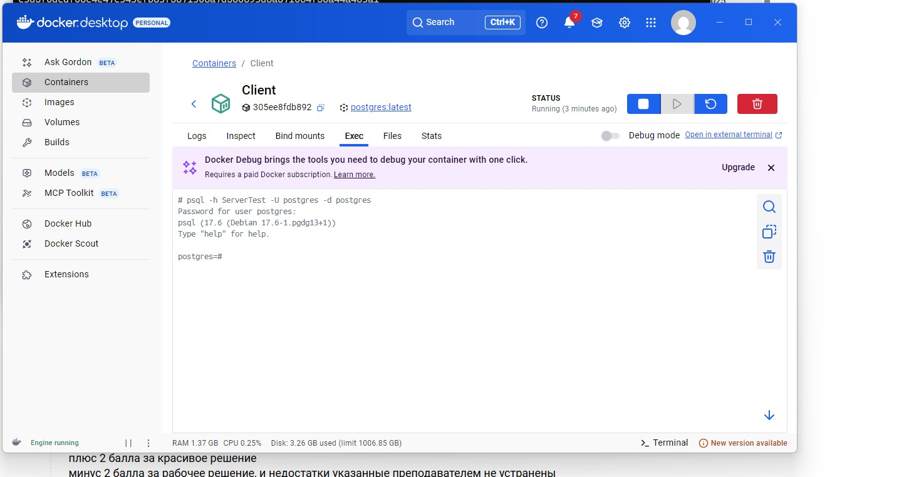
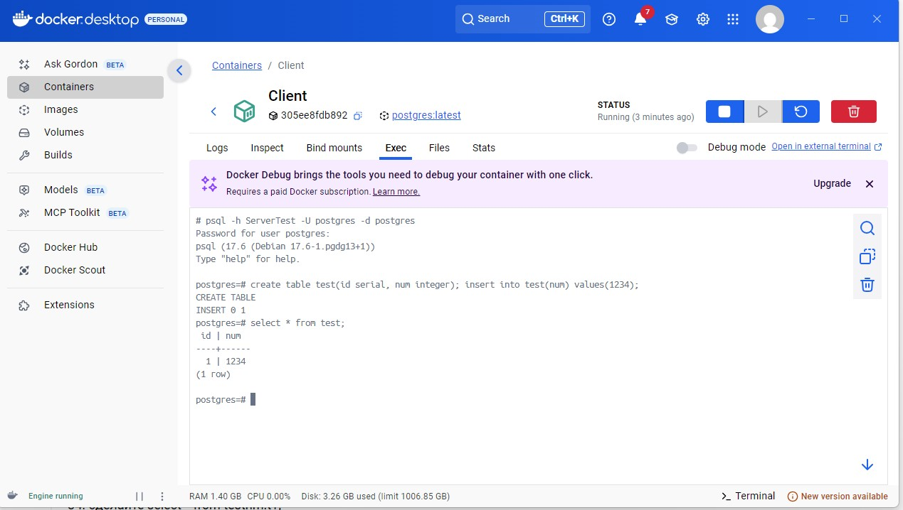
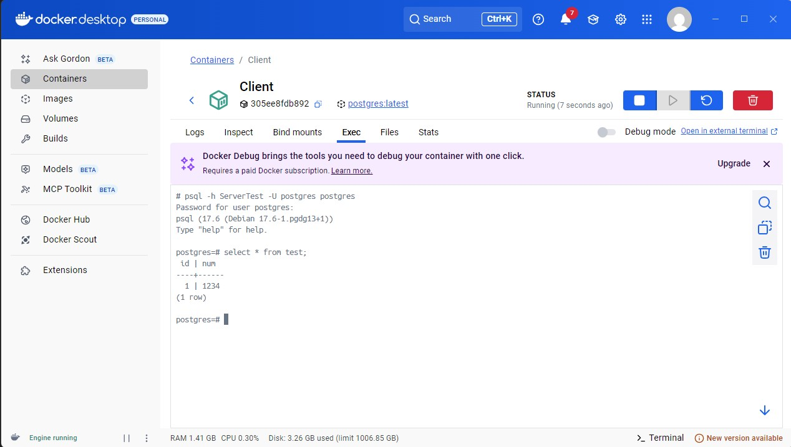

### Домашнее задание 3 ###
1.Создана сеть : docker network create testnetwork
1.Создали контейнер с сервером: docker run --name ServerTest --network testnetwork -e POSTGRES_PASSWORD=Verof2031 -p 5433:5433 -v /var/lib/postgres:/var/lib/postgresql/data -d postgres
1. Развернут клиент docker run --name Client --network testnetwork -e POSTGRES_PASSWORD=Abbott2031  -d postgres
1. Подключились к серверу: 
1. Создали на сервере таблицу: 
1. Удалили контейнер с сервером, пересоздали и благополучно открыли таблицу : 

