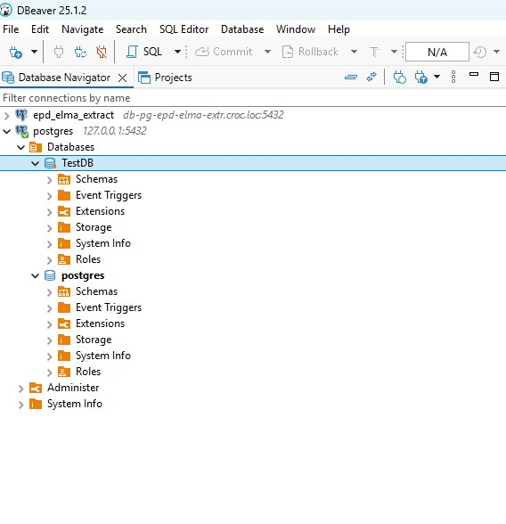
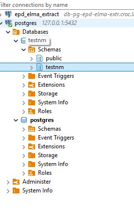
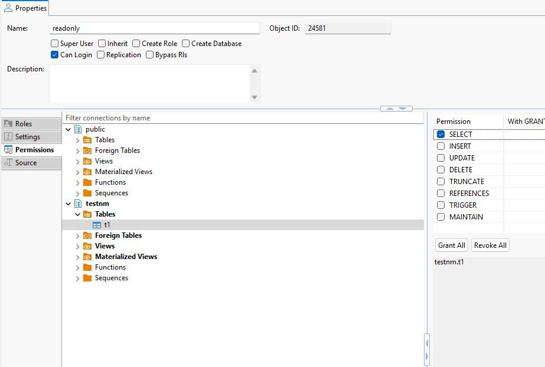
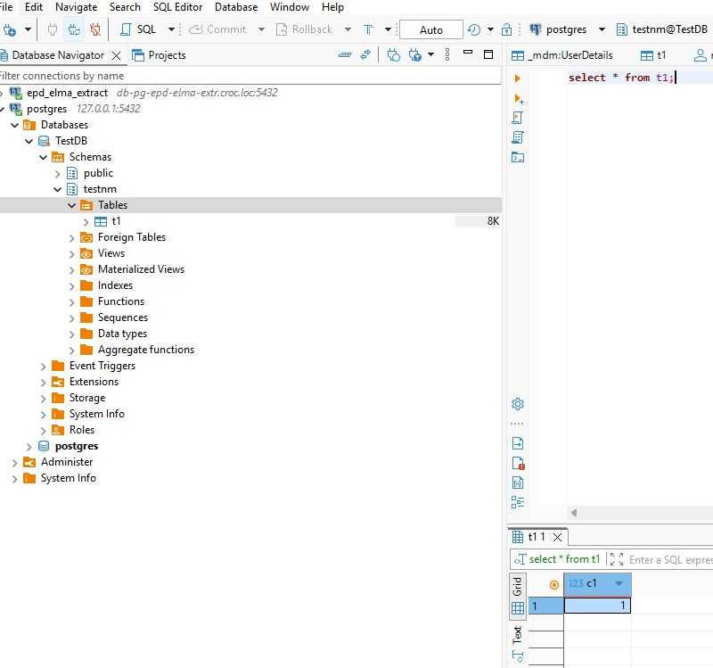
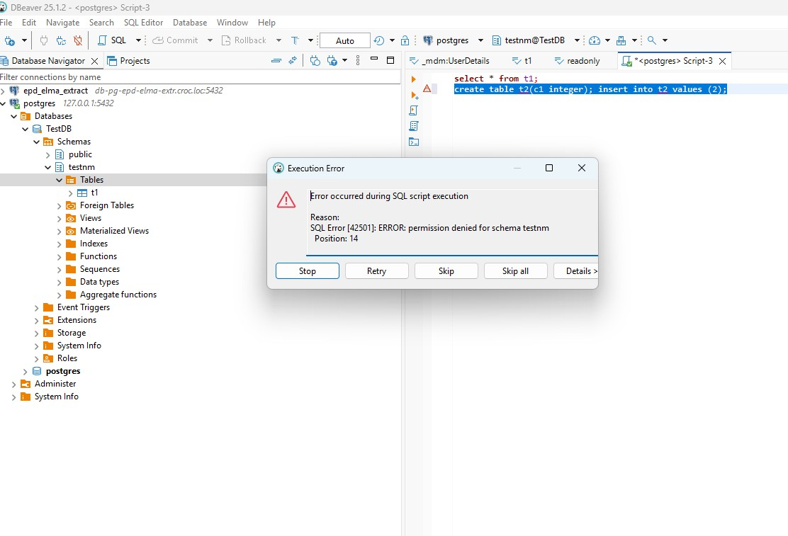
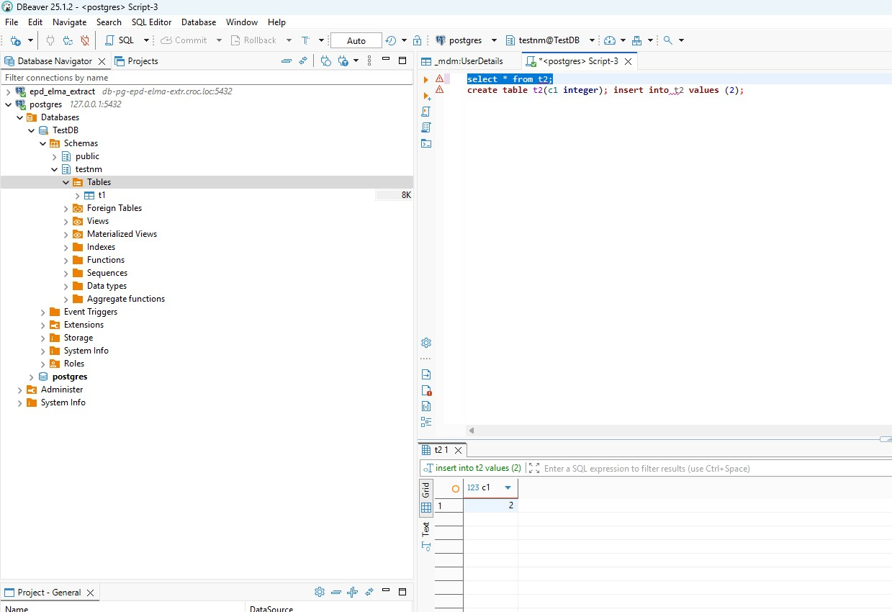

### Домашнее задание 5 ###
1. Создана база 

1. Создана схема

1. Создана таблица 
1. Создана роль CREATE ROLE readonly NOSUPERUSER NOCREATEDB NOCREATEROLE NOINHERIT LOGIN NOREPLICATION NOBYPASSRLS;
GRANT USAGE ON SCHEMA testnm TO readonly;
ALTER DEFAULT PRIVILEGES IN SCHEMA testnm GRANT SELECT ON TABLES TO readonly;
1. При попытке чтения под юзером testread имеем ошибку SQL Error [42501]: ERROR: permission denied for table t1 Таблица вообще-то в схеме testnm. При задании прав через DBeaver не установилось право на select самой таблицы.  В sql это: GRANT SELECT ON TABLE testnm.t1 TO readonly; Прекрасно читаем : . Повторюсь - права выдавал через интерфейс Dbeaver, как и в большинстве случаев на практике с БД ( только был mssql).
1. п.29-30 ДЗ. При создании прав давать всегда права на сами таблицы. Или на всю базу(схему) в зависимости от необходимости.
1. Попытка создать новую таблицу не успешна:  Нет прав. Таблица создается в схеме testnm , в ней нет прав на создание . Меняем права: ALTER DEFAULT PRIVILEGES FOR ROLE postgres IN SCHEMA testnm GRANT INSERT ON TABLES TO readonly;
GRANT CREATE ON SCHEMA testnm TO readonly; 

