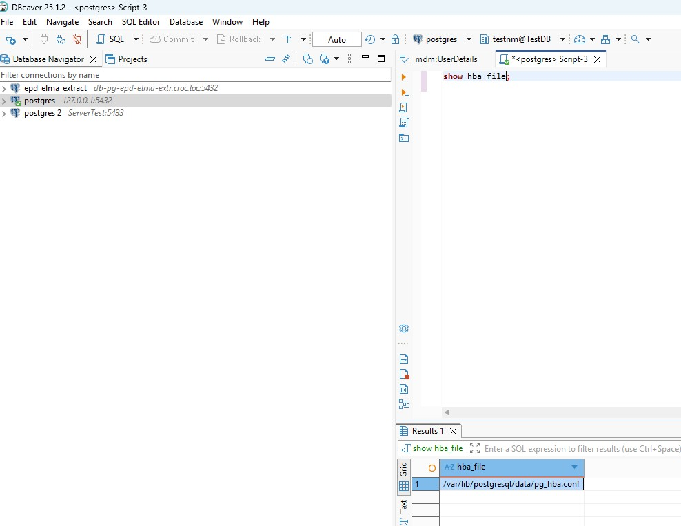
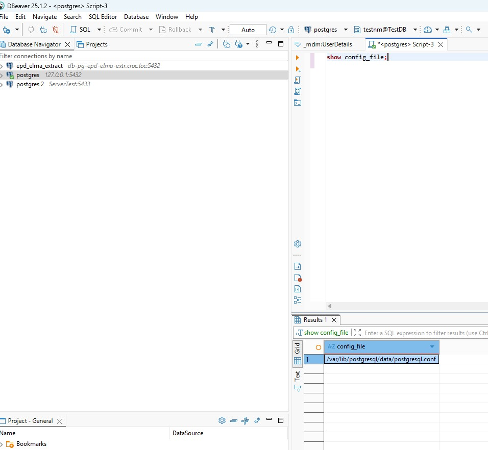
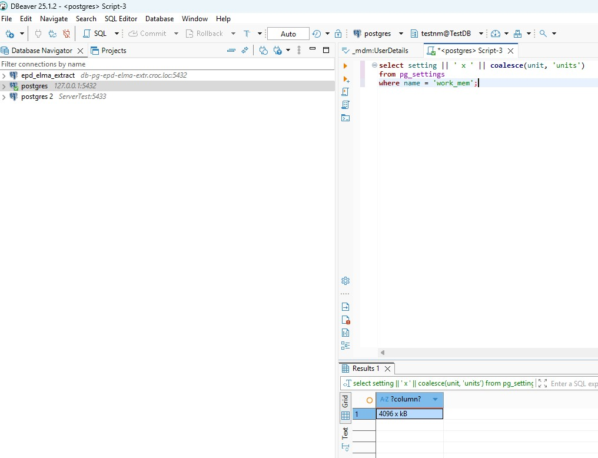
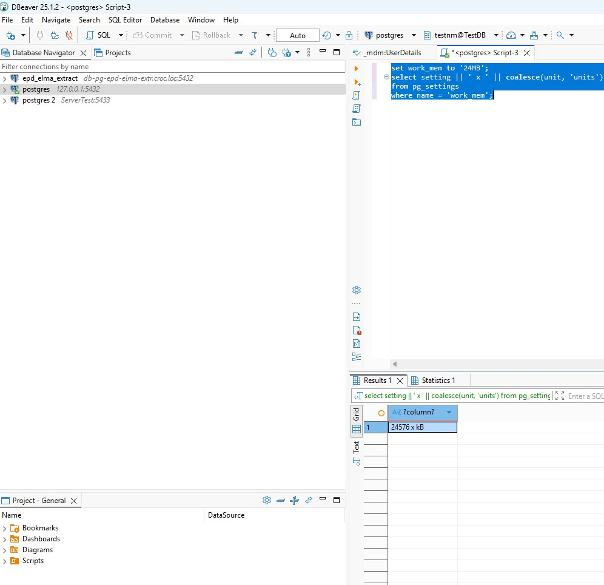
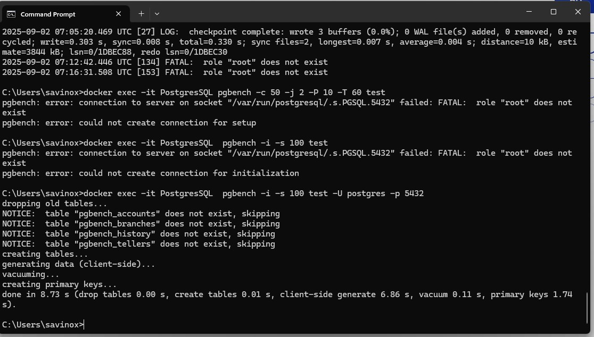
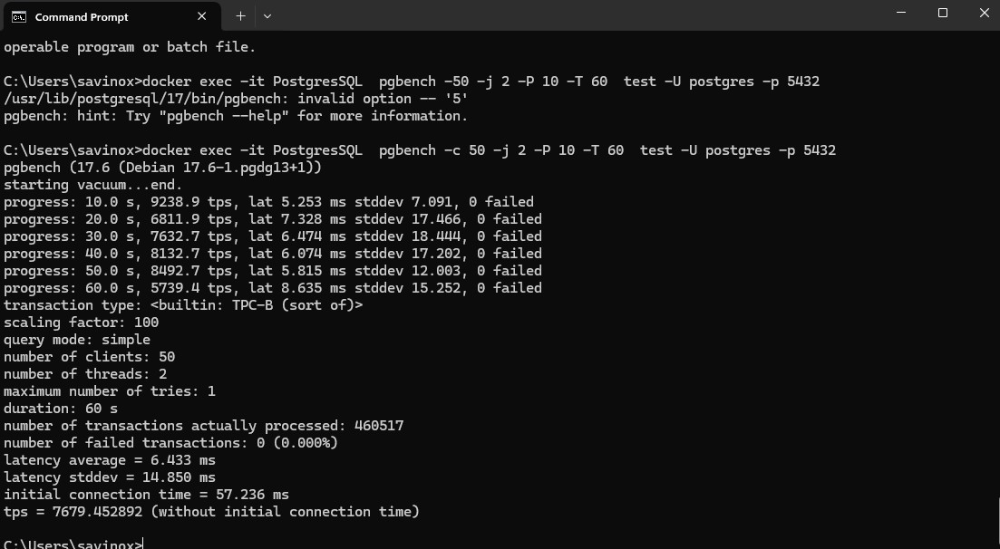
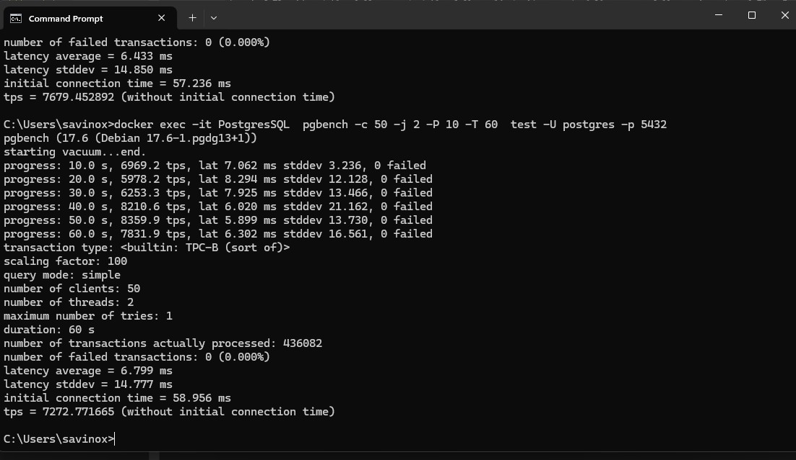

### Домашнее задание 6 ###
1.Смотрим настройки:  
1. Текущая память: 
1. Увеличили память: 
1. Запуск bench для создания тестовой базы 
1. Запуск bench для тестирования  Т.е. мы при установке памяти в 24 МБ имеем tps 7679, сбрасываем пямять снова до 4 и тестируем: 
1. Изменения параметров файла config не увеличили tps , достигнутый при значении памяти 24MB.

