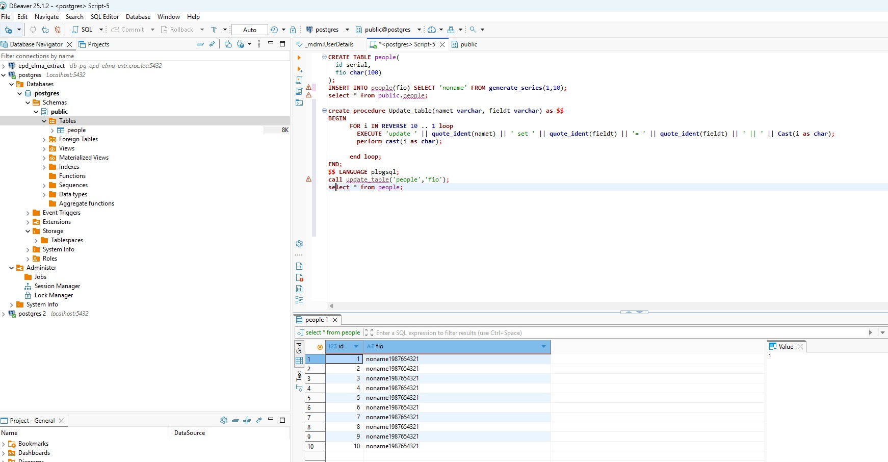

### Домашнее задание 7 ###
1.Запустили bench: 
1. Меняем параметры файла и запускаем bench снова:  Видим уменьшение времени initial connection, незначительное увеличение количества транзакций (примерно 8000) и незначительное увеличение tps, что связано с увеличением shared_buffers, wal_buffers позволяет накопить больше записей перед сбросом на диск, что сокращает время.
Создали таблицу с 1000000 строк: 
Смотрим размер файла с таблицей: 
Последовательно 5 раз обновили поле в таблице, прибавляя цифру, после чего смотрим размер:
Видим, чтот автовакуум пришел, количество мертвых туплов равно 0: 
Отключаем автовакуум, 10 раз обновляем таблицу, смотрим новый размер файла: 
Если теперь посмотреть количество мертвых строк, то видим, что их очень много: 
Включаем автовакуум и смотрим, что произошло с мертвыми строками: . Их нет. Делаем вывод, что использование автовакуума уменьшает количество "мусора" в таблице и уменьшает ее размер. 
Для теста процедуры создали таблицу: 
Результат работы порцедуры: 

