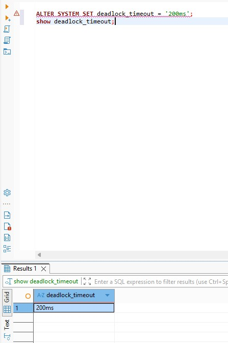
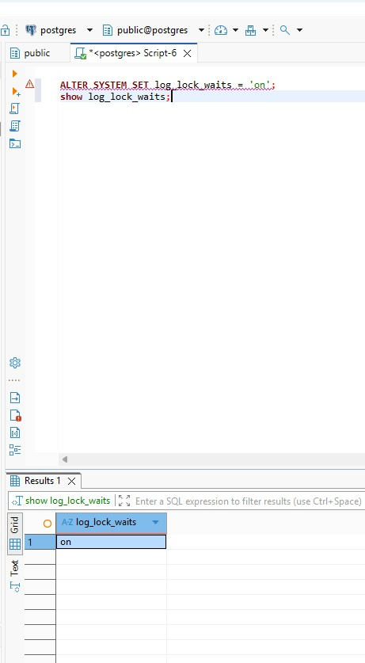
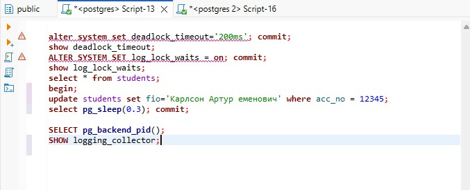
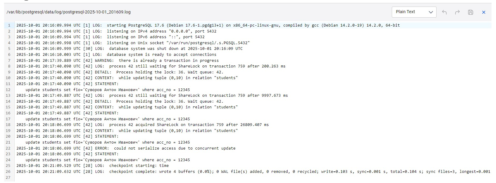
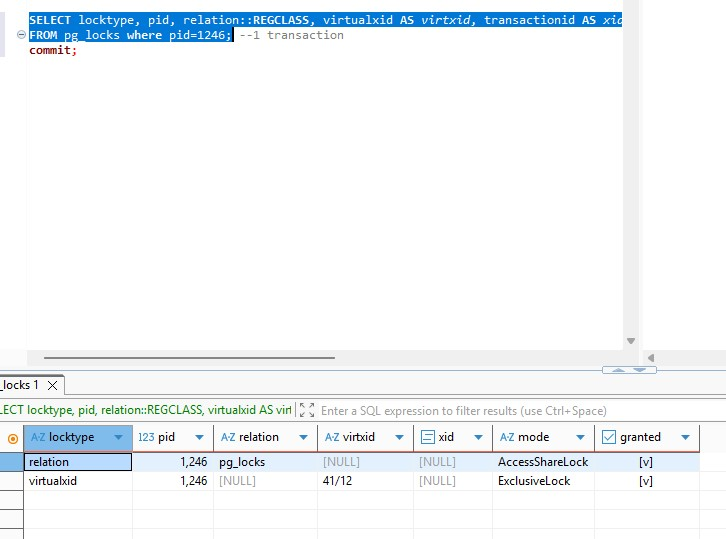
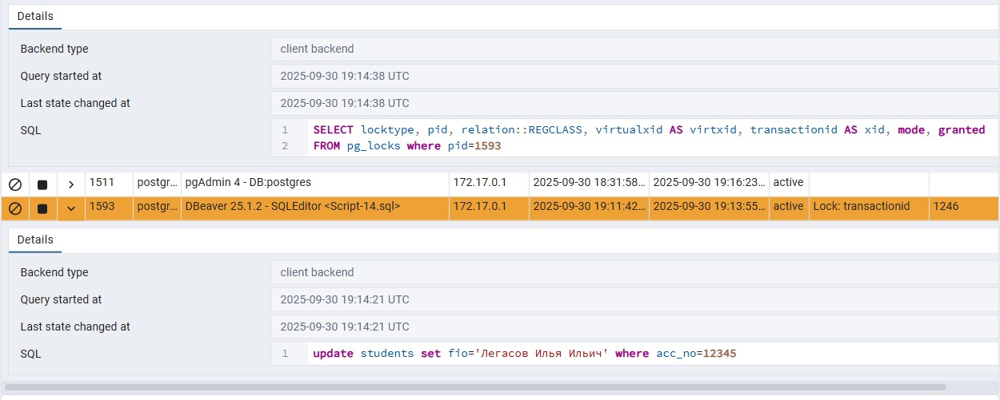
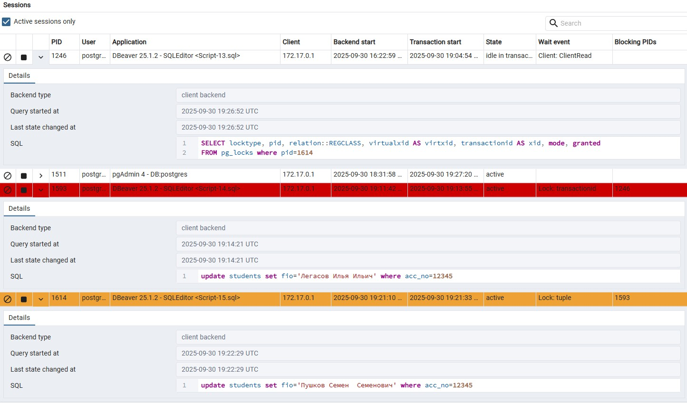
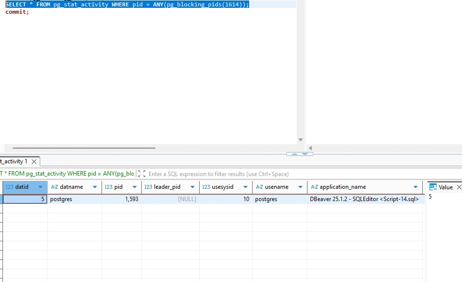
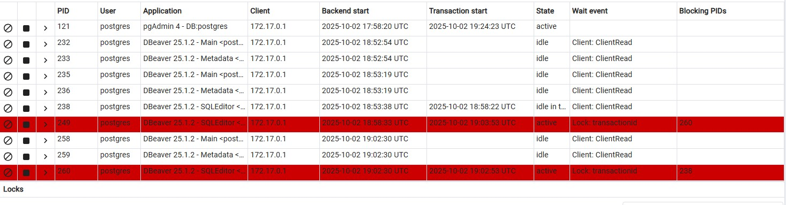

### Домашнее задание 9 ###
1. Настроим журнал на вывод сообщений о блокировках более 200 мс: ,
. Кроме этого для вывода сообщений в журнал в докере следует выполнить  указания из  https://www.geeksforgeeks.org/devops/log-all-queries-in-the-official-postgres-docker-image/?ysclid=mg8f6h4oub9146685
1. Смоделируем ситуацию, при которой появятся такие блокировки. В сессии 1 проводим апдейт таблицы:  Во второй сессии запускаем аналогичный апдейт этой строки таблицы. В первой сесcии делаем задержку 0.3 секунды, после чего делаем commit в первой сесcии, затем во второй. Смотрим журнал: . Видим в журнале сообщения о блокировках и запросах, которые их вызвали.
1.Делаем update в трех сеансах одной строки. Первоначально запускаем транзакцию 1 и не делаем апдейт. Видим две блокировки: 1 - ExcusiveLock  - номер сесии , и 2 - AccessShareLock - в pg_locks. . Далее запускаем апдейт в первой сессии сначала, затем во второй  сесии, она блокируется первой: 
. Заупскаем апдейт в 3 сессии, видим, что она блокирована второй: . Посмотреть блокировку мы можем и в dbeaver: 

1. Моделируем ситуацию взаимоблокировок. 

Сессия 1: begin;

update buh set debet=debet-1000 where acc_no=1;

update buh set debet=debet+1000 where acc_no=2;

Сессия 2:
begin;

update Buh set debet=debet-500 where acc_no=2;

update Buh set debet=debet+500 where acc_no=1;

update Buh set debet=debet-500 where acc_no=10;

Сессия 3:

update Buh set debet=debet-1500 where acc_no=10;

update Buh set debet=debet+1500 where acc_no=2;

Журнал:

2025-10-02 19:02:15.628 UTC [249] LOG:  execute <unnamed>: update Buh set debet=debet+500 where acc_no=1

2025-10-02 19:02:16.630 UTC [249] LOG:  process 249 detected deadlock while waiting for ShareLock on transaction 797 after 1002.037 ms

2025-10-02 19:02:16.630 UTC [249] DETAIL:  Process holding the lock: 238. Wait queue: .

2025-10-02 19:02:16.630 UTC [249] CONTEXT:  while updating tuple (0,1) in relation "buh"

2025-10-02 19:02:16.630 UTC [249] STATEMENT:  update Buh set debet=debet+500 where acc_no=1

2025-10-02 19:02:16.630 UTC [249] ERROR:  deadlock detected

2025-10-02 19:02:16.630 UTC [249] DETAIL:  Process 249 waits for ShareLock on transaction 797; blocked by process 238.
	Process 238 waits for ShareLock on transaction 798; blocked by process 249.
	Process 249: update Buh set debet=debet+500 where acc_no=1
	Process 238: update buh set debet=debet+1000 where acc_no=2

2025-10-02 19:02:16.630 UTC [249] HINT:  See server log for query details.

2025-10-02 19:02:16.630 UTC [249] CONTEXT:  while updating tuple (0,1) in relation "buh"

2025-10-02 19:02:16.630 UTC [249] STATEMENT:  update Buh set debet=debet+500 where acc_no=1

2025-10-02 19:02:16.630 UTC [238] LOG:  process 238 acquired ShareLock on transaction 798 after 35934.196 ms

2025-10-02 19:02:16.630 UTC [238] CONTEXT:  while updating tuple (0,2) in relation "buh"

2025-10-02 19:02:16.630 UTC [238] STATEMENT:  update buh set debet=debet+1000 where acc_no=2

2025-10-02 19:03:11.858 UTC [260] LOG:  execute <unnamed>: update Buh set debet=debet+1500 where acc_no=2

2025-10-02 19:03:12.858 UTC [260] LOG:  process 260 still waiting for ShareLock on transaction 797 after 1000.129 ms

2025-10-02 19:03:12.858 UTC [260] DETAIL:  Process holding the lock: 238. Wait queue: 260.

2025-10-02 19:03:12.858 UTC [260] CONTEXT:  while updating tuple (0,2) in relation "buh"

2025-10-02 19:03:12.858 UTC [260] STATEMENT:  update Buh set debet=debet+1500 where acc_no=2

2025-10-02 19:03:53.276 UTC [249] ERROR:  current transaction is aborted, commands ignored until end of transaction block

2025-10-02 19:03:53.276 UTC [249] STATEMENT:  update Buh set debet=debet-500 where acc_no=10

2025-10-02 19:03:53.281 UTC [249] LOG:  execute <unnamed>: ROLLBACK

2025-10-02 19:03:53.285 UTC [249] LOG:  execute <unnamed>: BEGIN

2025-10-02 19:03:53.285 UTC [249] LOG:  execute <unnamed>: update Buh set debet=debet-500 where acc_no=10

2025-10-02 19:03:54.285 UTC [249] LOG:  process 249 still waiting for ShareLock on transaction 799 after 1000.296 ms

2025-10-02 19:03:54.285 UTC [249] DETAIL:  Process holding the lock: 260. Wait queue: 249.

2025-10-02 19:03:54.285 UTC [249] CONTEXT:  while updating tuple (0,3) in relation "buh"

2025-10-02 19:03:54.285 UTC [249] STATEMENT:  update Buh set debet=debet-500 where acc_no=10

Видим ситуацию наглядно в PGAdmin:

4. Две транзакции, изменяющие таблицу без where могут заблокировать друг друга, т.к. запрос без where запустит изменение всех строк таблицы, соответственно, может сложиться ситуация, когда две транзакции одновременно попытаются изменить одну строку. 